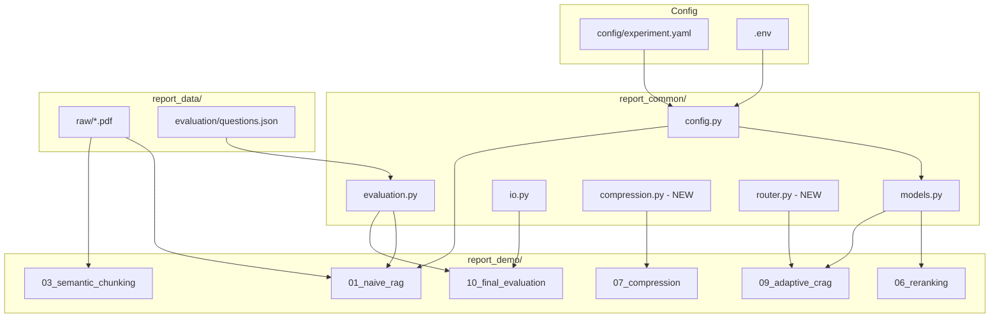
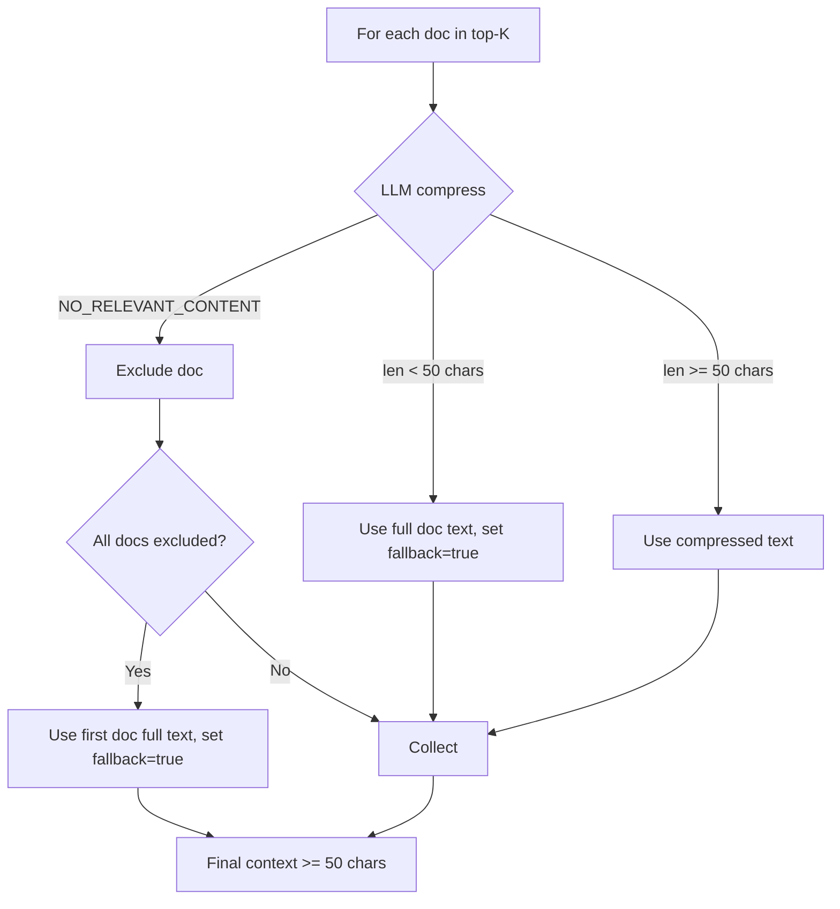
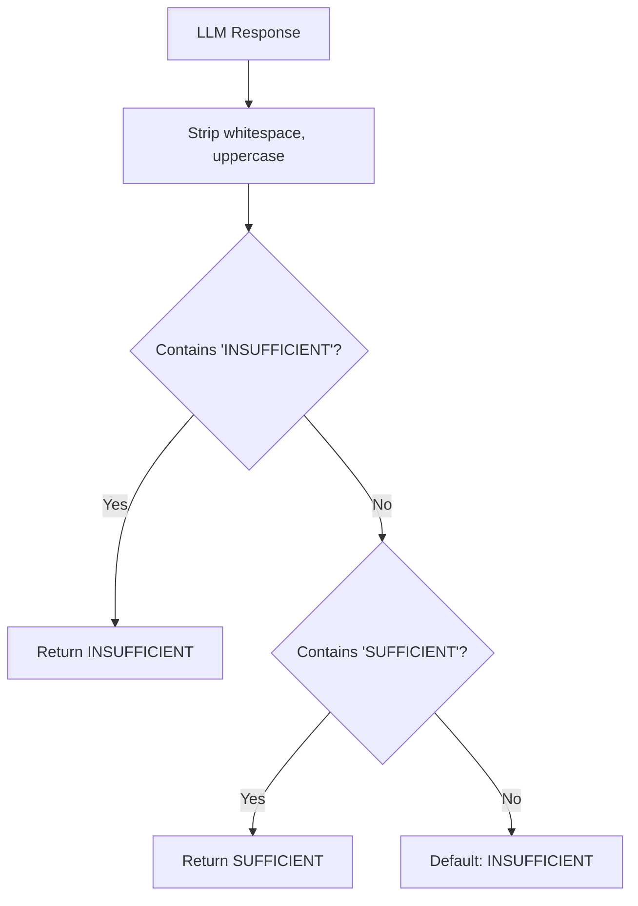

# Design Document: RAG Pipeline Improvements

## Overview

This design addresses 10 improvement areas in the RAG experimental pipeline for an Information Retrieval course project. The pipeline consists of shared utilities (`report_common/`), a central YAML configuration (`config/experiment.yaml`), and 10 Jupyter notebooks (`report_demo/01-10`) that progressively build and evaluate RAG techniques against a 30-question ground-truth evaluation set.

The core problems being solved:

1. **Source ID mismatch** — PyPDFLoader stores full file paths in metadata, but ground-truth uses bare filenames. Metrics always report 0.
2. **Evaluation granularity** — Currently file-level only; needs page/chunk-level precision.
3. **Config inaccuracy** — `chunk_unit: token` is wrong; `RecursiveCharacterTextSplitter` with `len` measures characters.
4. **Metadata loss** — Semantic chunking (notebook 03) discards source/page metadata.
5. **Compression fragility** — Empty compression output causes generation to receive no context.
6. **Reranker inefficiency** — LLM-based reranking is slow and expensive (30 LLM calls per query).
7. **Classification bug** — `'SUFFICIENT' in resp` matches both SUFFICIENT and INSUFFICIENT.
8. **Router weakness** — No few-shot examples, no CONFLICTING category.
9. **Missing generation metrics** — No faithfulness, relevancy, or hallucination measurement.
10. **Incomplete final evaluation** — Hardcoded experiment references, missing experiments in comparison.

**Design Principles:**
- All changes are backward-compatible within the pipeline
- Shared logic goes in `report_common/`; notebooks consume utilities
- Configuration is centralized in `experiment.yaml`
- New dependencies are pinned in `requirements-report.txt`

## Architecture



### Key Architectural Decisions

1. **Source ID generation as a shared utility** — A `format_chunk_id()` / `format_page_id()` / `extract_page_id()` function set in `report_common/evaluation.py` ensures all notebooks produce and parse IDs consistently. This eliminates the current bug where each notebook constructs IDs differently.

2. **Cross-encoder reranker in `report_common/models.py`** — Replaces inline LLM scoring. The `sentence-transformers` `CrossEncoder` class provides batch scoring in a single call, making it reusable across notebooks 06, 07, 08, and 09.

3. **Compression logic in a new `report_common/compression.py`** — Isolates fallback logic from notebook code. Notebooks call `compress_with_fallback()` instead of reimplementing compression + error handling inline.

4. **Router logic in a new `report_common/router.py`** — The few-shot prompt and category parsing are maintained in one place rather than duplicated if reused.

5. **Generation metrics alongside retrieval metrics** in `evaluation.py` — Keeps all metric computation in one module. Functions accept an optional `llm` parameter for easy mocking in tests.

6. **Dynamic file discovery in final evaluation** — `glob("A*.jsonl")` with alphanumeric sort replaces hardcoded filenames.

## Components and Interfaces

### 1. Source ID Functions (`report_common/evaluation.py`)

```python
import re
from typing import Optional

SOURCE_ID_PATTERN = re.compile(r'^(.+)::page_(\d+)::chunk_(\d+)$')
PAGE_ID_PATTERN = re.compile(r'^(.+)::page_(\d+)$')

def format_page_id(filename: str, page_number: int) -> str:
    """Format a page-level ID: {filename}::page_{N}"""
    return f"{filename}::page_{page_number}"

def format_chunk_id(filename: str, page_number: int, chunk_index: int) -> str:
    """Format a chunk-level ID: {filename}::page_{N}::chunk_{M}"""
    return f"{filename}::page_{page_number}::chunk_{chunk_index}"

def extract_page_id(chunk_id: str) -> Optional[str]:
    """Extract page-level prefix from chunk ID. Returns None if format unrecognized."""
    match = SOURCE_ID_PATTERN.match(chunk_id)
    if match:
        return f"{match.group(1)}::page_{match.group(2)}"
    # Check if already a page-level ID
    if PAGE_ID_PATTERN.match(chunk_id):
        return chunk_id
    return None
```

### 2. Enhanced Retrieval Metrics (`report_common/evaluation.py`)

```python
def compute_retrieval_metrics(
    retrieved_ids: List[str],
    relevant_ids: List[str],
    k: int = 5,
    granularity: str = "auto",
    relevant_chunks: List[str] = None,
) -> dict:
    """
    Compute retrieval metrics with configurable granularity.
    
    Args:
        retrieved_ids: Source IDs of retrieved chunks
        relevant_ids: Ground-truth page-level IDs (relevant_documents expanded)
        k: Cutoff for @k metrics
        granularity: "chunk", "page", or "auto"
        relevant_chunks: Ground-truth chunk-level IDs (optional)
    
    Granularity behavior:
        - "chunk": exact match against relevant_chunks (fallback to page if empty)
        - "page": extract page prefix from retrieved, match against relevant_ids
        - "auto": use chunk if relevant_chunks non-empty, else page
    """
    ...
```

### 3. Generation Metrics (`report_common/evaluation.py`)

```python
def compute_faithfulness(answer: str, context: str, llm=None) -> float:
    """
    Decompose answer into atomic claims, check each against context.
    Returns: supported_claims / total_claims (0.0-1.0)
    
    Edge cases:
        - Empty answer → return 0.0 (no LLM call)
        - Empty context → return 0.0 (no LLM call)
        - LLM failure → raise exception
    """
    ...

def compute_relevancy(answer: str, question: str, llm=None) -> float:
    """
    Judge whether answer addresses the question.
    Returns: 0.0 (irrelevant) to 1.0 (fully addresses).
    
    Edge cases:
        - Empty answer → return 0.0 (no LLM call)
        - LLM failure → raise exception
    """
    ...

def compute_hallucination_rate(answer: str, context: str, llm=None) -> float:
    """
    Decompose answer into atomic claims, count unsupported.
    Returns: unsupported_claims / total_claims (0.0-1.0)
    
    Invariant: faithfulness + hallucination_rate ≈ 1.0 (tolerance 0.01)
    
    Edge cases:
        - Empty answer → return 0.0 (no LLM call)
        - Empty context → return 1.0 (no LLM call)
        - LLM failure → raise exception
    """
    ...
```

### 4. Cross-Encoder Reranker (`report_common/models.py`)

```python
from sentence_transformers import CrossEncoder
from typing import List, Tuple, Any, Dict

def build_cross_encoder(config: Dict[str, Any]) -> CrossEncoder:
    """
    Load cross-encoder model from config['reranker']['model_name'].
    Raises RuntimeError if model cannot be loaded.
    """
    model_name = config.get("reranker", {}).get(
        "model_name", "cross-encoder/ms-marco-MiniLM-L-6-v2"
    )
    try:
        return CrossEncoder(model_name)
    except Exception as e:
        raise RuntimeError(
            f"Failed to load cross-encoder model '{model_name}': {e}"
        ) from e

def cross_encoder_rerank(
    query: str,
    documents: List,
    cross_encoder: CrossEncoder,
    top_k: int = 5,
) -> List[Tuple[Any, float]]:
    """
    Score all (query, doc) pairs in a single batch predict call.
    Returns top_k documents sorted by descending score.
    
    Each document's page_content is truncated to the model's max input.
    """
    if not documents:
        return []
    pairs = [(query, doc.page_content[:512]) for doc in documents]
    scores = cross_encoder.predict(pairs)
    scored = list(zip(documents, scores))
    scored.sort(key=lambda x: x[1], reverse=True)
    return scored[:top_k]
```

### 5. Compression with Fallback (`report_common/compression.py` — NEW)

```python
from typing import List, Tuple

MIN_COMPRESSED_LENGTH = 50

def compress_with_fallback(
    query: str,
    documents: List,
    compress_fn,  # callable(query, doc_text) -> str
    min_length: int = MIN_COMPRESSED_LENGTH,
) -> Tuple[str, bool]:
    """
    Compress documents; fallback to full context if compression fails.
    
    Logic:
    1. For each doc, call compress_fn(query, doc.page_content)
    2. If result is "NO_RELEVANT_CONTENT" → exclude doc
    3. If result is empty/whitespace or < min_length chars → use full doc text (fallback)
    4. If ALL docs excluded/failed → use first doc's full text
    5. Final context must be >= min_length chars
    
    Returns:
        (context_text, fallback_triggered)
    """
    ...
```

### 6. Router and Sufficiency (`report_common/router.py` — NEW)

```python
CATEGORIES = ["IDENTIFIER", "SEMANTIC", "MULTI_HOP", "CONFLICTING", "OUT_OF_SCOPE"]

def parse_route_response(response: str) -> str:
    """
    Parse LLM response to extract category.
    Returns category string or "SEMANTIC" as default.
    """
    upper = response.strip().upper()
    for cat in CATEGORIES:
        if cat in upper:
            return cat
    return "SEMANTIC"

def parse_sufficiency_response(response: str) -> str:
    """
    Parse sufficiency LLM response.
    CRITICAL: Check INSUFFICIENT before SUFFICIENT.
    Default: INSUFFICIENT if neither found.
    """
    upper = response.strip().upper()
    if "INSUFFICIENT" in upper:
        return "INSUFFICIENT"
    if "SUFFICIENT" in upper:
        return "SUFFICIENT"
    return "INSUFFICIENT"

def prepare_sufficiency_context(documents: List, max_chars: int = 1500) -> str:
    """
    Concatenate top-3 docs' full page_content, truncate to max_chars.
    """
    texts = [doc.page_content for doc in documents[:3]]
    combined = "\n\n".join(texts)
    return combined[:max_chars]
```

### 7. Semantic Chunk Metadata (used in notebook 03)

```python
def compute_page_offsets(pages: List, separator: str = "\n\n") -> Tuple[str, List[int]]:
    """
    Concatenate page texts with separator, return (full_text, offsets).
    offsets[i] = starting character index of page i in full_text.
    """
    ...

def find_page_for_position(position: int, offsets: List[int], page_lengths: List[int]) -> int:
    """
    Given a character position in concatenated text, find which page it belongs to.
    Uses binary search on offsets.
    """
    ...

def attach_metadata_to_semantic_chunks(
    pages: List,
    semantic_chunks: List,
    filename: str,
    separator: str = "\n\n",
) -> List:
    """
    Assign page metadata to semantic chunks via character offset tracking.
    - Discards empty/whitespace chunks
    - Assigns sequential chunk_index (no gaps)
    - Sets source_id in format {filename}::page_{N}::chunk_{M}
    """
    ...
```

### 8. Final Evaluation (notebook 10 logic)

```python
def discover_experiments(results_dir: Path) -> List[Tuple[str, List[dict]]]:
    """
    Discover all A*.jsonl files, sorted alphanumerically.
    Returns list of (experiment_name, records).
    """
    ...

def build_comparison_table(experiments: dict) -> pd.DataFrame:
    """
    One row per experiment with: name, n_questions, mean of each metric,
    faithfulness, relevancy, hallucination_rate, mean_latency, p95_latency.
    """
    ...

def build_category_breakdown(experiment_records: List[dict], questions: List[dict]) -> pd.DataFrame:
    """Per-category metric averages for one experiment."""
    ...

def build_pairwise_deltas(experiments: dict, baseline_name: str = "A0") -> pd.DataFrame:
    """Delta of each experiment vs baseline for all metrics."""
    ...
```

## Data Models

### Source ID Format

```
Page-level:  {filename}::page_{N}
Chunk-level: {filename}::page_{N}::chunk_{M}

Example: Understanding_Climate_Change.pdf::page_3::chunk_2
```

- `{filename}`: PDF file name without directory path (e.g., `Understanding_Climate_Change.pdf`)
- `{N}`: Zero-indexed page number
- `{M}`: Zero-indexed chunk index (within page for fixed chunking, global for semantic chunking)

Regex: `^[^:]+::page_\d+::chunk_\d+$`

### Updated `questions.json` Schema

```json
{
  "question_id": "Q001",
  "question": "What is the main cause of climate change?",
  "category": "fact_lookup",
  "relevant_documents": ["Understanding_Climate_Change.pdf"],
  "relevant_chunks": ["Understanding_Climate_Change.pdf::page_3::chunk_2"],
  "required_facts": ["greenhouse gases", "human activities"],
  "reference_answer": "...",
  "should_abstain": false
}
```

The `relevant_chunks` field is additive — existing questions without chunk-level ground truth keep `relevant_chunks: []` and evaluation falls back to page-level matching.

### Updated `config/experiment.yaml`

```yaml
baseline:
  chunk_size: 500
  chunk_overlap: 50
  chunk_unit: character  # FIXED: was "token"

reranker:  # NEW section
  model_name: cross-encoder/ms-marco-MiniLM-L-6-v2
  top_k: 5  # defaults to retrieval.final_top_k
```

### Result Record Schema (Extended)

```json
{
  "experiment_id": "A6_COMPRESSION",
  "notebook": "07_contextual_compression.ipynb",
  "config_hash": "abc123def456",
  "seed": 42,
  "question_id": "Q001",
  "question": "...",
  "retrieved_documents": [
    {"source_id": "Understanding_Climate_Change.pdf::page_2::chunk_0", "score": 0.95}
  ],
  "answer": "...",
  "citations": [],
  "predicted_abstain": false,
  "compression_fallback": false,
  "route": "SEMANTIC",
  "latency": {
    "retrieval_seconds": 0.12,
    "rerank_seconds": 0.03,
    "generation_seconds": 1.5,
    "total_seconds": 1.65
  },
  "usage": {},
  "metrics": {
    "hit_rate_at_5": 1.0,
    "precision_at_5": 0.2,
    "recall_at_5": 1.0,
    "mrr": 1.0,
    "ndcg_at_5": 1.0,
    "faithfulness": 0.85,
    "relevancy": 0.9,
    "hallucination_rate": 0.15
  },
  "error": null
}
```

### Compression Fallback Flow



### Sufficiency Parsing Logic



### Router Categories

| Category | Retrieval Strategy | Generation Behavior |
|----------|-------------------|-------------------|
| IDENTIFIER | BM25 priority | Standard grounded generation |
| SEMANTIC | Dense retrieval | Standard grounded generation |
| MULTI_HOP | Hybrid RRF (larger pool) | Standard grounded generation |
| CONFLICTING | Standard retrieval | Indicate premise unsupported; `predicted_abstain=true` |
| OUT_OF_SCOPE | Top-1 dense + threshold check | Abstain if below threshold |


## Correctness Properties

*A property is a characteristic or behavior that should hold true across all valid executions of a system—essentially, a formal statement about what the system should do. Properties serve as the bridge between human-readable specifications and machine-verifiable correctness guarantees.*

### Property 1: Source ID Round-Trip

*For any* valid filename (non-empty string without `::` separator), page number (non-negative integer), and chunk index (non-negative integer), formatting a chunk ID with `format_chunk_id(filename, page, chunk)` and then parsing it with `extract_page_id()` SHALL return the page-level prefix `{filename}::page_{page}`, and the full chunk ID SHALL match the regex `^[^:]+::page_\d+::chunk_\d+$`.

**Validates: Requirements 1.1, 1.2, 1.5**

### Property 2: Retrieval Metrics Bounds

*For any* list of retrieved IDs and any set of relevant IDs with k > 0, `compute_retrieval_metrics` SHALL return values where: hit_rate ∈ {0.0, 1.0}, precision ∈ [0.0, 1.0], recall ∈ [0.0, 1.0], MRR ∈ [0.0, 1.0], nDCG ∈ [0.0, 1.0]; and hit_rate equals 1.0 if and only if at least one retrieved ID (in top-k) is in the relevant set.

**Validates: Requirements 1.4, 2.2**

### Property 3: Page-Level Fallback Matching

*For any* set of chunk IDs in format `{filename}::page_{N}::chunk_{M}` and a set of page-level relevant IDs in format `{filename}::page_{N}`, when granularity is "auto" and relevant_chunks is empty, `compute_retrieval_metrics` SHALL produce the same hit_rate result as comparing the extracted page prefixes against the relevant page IDs directly.

**Validates: Requirements 1.5, 2.3, 2.5**

### Property 4: Character Offset Page Assignment

*For any* list of non-empty page texts concatenated with `\n\n` separator, and for any character position within the concatenated string that falls within a page's content (not within a separator), `find_page_for_position` SHALL return the page index `i` such that the character at that position belongs to page `i`'s content in the original list.

**Validates: Requirements 4.1, 4.3, 4.6**

### Property 5: Semantic Chunk Metadata Invariants

*For any* list of pages and resulting semantic chunks (after filtering), `attach_metadata_to_semantic_chunks` SHALL produce output where: (a) every chunk has `source`, `page`, and `chunk_index` fields in metadata, (b) every chunk's source_id matches `^.+::page_\d+::chunk_\d+$`, (c) no chunk has empty or whitespace-only page_content, and (d) chunk_index values form a contiguous sequence starting at 0.

**Validates: Requirements 4.2, 4.4, 4.5**

### Property 6: Compression Fallback Guarantees

*For any* non-empty list of documents where each document has page_content of at least 50 characters, `compress_with_fallback` SHALL return a context string of at least 50 characters, and the fallback boolean SHALL be `true` if and only if any document's compressed output was replaced with its full text or the all-failed fallback was used.

**Validates: Requirements 5.1, 5.4, 5.5**

### Property 7: Sufficiency Parsing Priority

*For any* string that contains the substring "INSUFFICIENT" (case-insensitive), `parse_sufficiency_response` SHALL return "INSUFFICIENT" regardless of whether "SUFFICIENT" also appears as a substring. *For any* string containing neither "SUFFICIENT" nor "INSUFFICIENT", the function SHALL return "INSUFFICIENT".

**Validates: Requirements 7.1, 7.3**

### Property 8: Router Default Fallback

*For any* string that does not contain any of the category keywords (IDENTIFIER, SEMANTIC, MULTI_HOP, CONFLICTING, OUT_OF_SCOPE) as substrings (case-insensitive), `parse_route_response` SHALL return "SEMANTIC".

**Validates: Requirements 8.3**

### Property 9: Faithfulness and Hallucination Complementarity

*For any* answer and context pair where the claim decomposition produces N > 0 total claims with S supported claims, `compute_faithfulness` SHALL return S/N and `compute_hallucination_rate` SHALL return (N-S)/N, such that their sum equals 1.0 within floating-point tolerance of 0.01.

**Validates: Requirements 9.1, 9.3, 9.4**

### Property 10: Evaluation Summary Completeness

*For any* set of experiment result files (each containing at least one record with a `metrics` dictionary), the summary aggregation SHALL produce a table with exactly one row per experiment file, where each row contains the mean value of every numeric metric key found across that experiment's records.

**Validates: Requirements 10.1, 10.2, 10.6**

## Error Handling

### Configuration Errors

| Error Condition | Handling |
|----------------|----------|
| `reranker.model_name` missing from config | Default to `cross-encoder/ms-marco-MiniLM-L-6-v2` |
| `reranker.top_k` missing from config | Default to value of `retrieval.final_top_k` |
| Invalid `granularity` value passed | Raise `ValueError` listing valid options: "chunk", "page", "auto" |

### Cross-Encoder Errors

| Error Condition | Handling |
|----------------|----------|
| Model fails to load or download | Raise `RuntimeError` with model name and failure reason; do NOT fallback to LLM reranking |
| Empty candidate list for reranking | Return empty list |
| Document text exceeds model max input | Truncate to 512 tokens before passing to `predict()` |

### Compression Errors

| Error Condition | Handling |
|----------------|----------|
| LLM returns empty or whitespace-only text | Use full uncompressed document text (per-doc fallback) |
| LLM returns text shorter than 50 characters | Use full uncompressed document text (per-doc fallback) |
| LLM returns "NO_RELEVANT_CONTENT" | Exclude that document from compressed context |
| All documents fail compression | Use first document's full text as last-resort fallback |
| LLM call fails (network/timeout) | Treat as compression failure, use full text for that doc |
| Final context would be empty | Guaranteed >= 50 chars via fallback logic |

### Generation Metrics Errors

| Error Condition | Handling |
|----------------|----------|
| `answer` is empty string | Return 0.0 without making LLM call |
| `context` is empty for `compute_faithfulness` | Return 0.0 without LLM call |
| `context` is empty for `compute_hallucination_rate` | Return 1.0 without LLM call |
| LLM returns unparseable response | Raise exception with error message indicating failure |
| LLM call fails (network/timeout) | Raise exception; do NOT return a numeric score |

### Sufficiency Evaluator Errors

| Error Condition | Handling |
|----------------|----------|
| Empty document list (zero docs retrieved) | Return "INSUFFICIENT" without LLM call |
| LLM response contains neither keyword | Default to "INSUFFICIENT" |
| LLM call fails | Default to "INSUFFICIENT" (triggers corrective retrieval) |

### Router Errors

| Error Condition | Handling |
|----------------|----------|
| LLM response doesn't match any category | Default to "SEMANTIC" retrieval |
| LLM call fails | Default to "SEMANTIC" retrieval |

### Final Evaluation Errors

| Error Condition | Handling |
|----------------|----------|
| Fewer than 9 experiment files (A0–A8) found | Print warning listing each missing experiment; continue with available files |
| Result file has no parseable records | Skip experiment with warning message |
| Record missing `metrics` dictionary | Skip that record in aggregation |

## Testing Strategy

### Property-Based Testing

This feature is well-suited for property-based testing because the core logic consists of pure functions (ID formatting/parsing, metric computation, text parsing, offset calculation) with clear input/output behavior and universal properties that should hold across a wide input space.

**Library**: [Hypothesis](https://hypothesis.readthedocs.io/) for Python

**Configuration**: Each property test runs minimum 100 iterations (`@settings(max_examples=100)`).

**Tag Format**: Each test includes a docstring comment referencing the design property:
```python
# Feature: rag-pipeline-improvements, Property N: <property_text>
```

**Property Tests to Implement**:

| # | Property | Module Under Test | Key Generators |
|---|----------|------------------|----------------|
| 1 | Source ID Round-Trip | `evaluation.py` | `st.text()` for filenames (filtered: no `::`), `st.integers(min_value=0)` |
| 2 | Retrieval Metrics Bounds | `evaluation.py` | `st.lists(st.text())` for ID lists, `st.integers(min_value=1, max_value=20)` for k |
| 3 | Page-Level Fallback | `evaluation.py` | Generated chunk IDs with known prefixes + page-level relevant IDs |
| 4 | Character Offset Assignment | offset utility | `st.lists(st.text(min_size=1))` for page texts |
| 5 | Semantic Chunk Metadata | `attach_metadata_to_semantic_chunks` | Lists of Document-like objects with varying content |
| 6 | Compression Fallback | `compression.py` | Mock `compress_fn` returning varied outputs (short, empty, NO_RELEVANT) |
| 7 | Sufficiency Parsing | `router.py` | `st.text()` combined with injected keywords |
| 8 | Router Default | `router.py` | `st.text()` filtered to exclude all category keywords |
| 9 | Faithfulness + Hallucination | `evaluation.py` | `st.integers(min_value=1)` for total claims, `st.integers()` for supported |
| 10 | Summary Completeness | final eval logic | Lists of dicts with random metric values |

### Unit Tests (Example-Based)

| Test Case | Requirement |
|-----------|-------------|
| `format_chunk_id("file.pdf", 0, 0)` → `"file.pdf::page_0::chunk_0"` | 1.1, 1.2 |
| Config loads with `chunk_unit == "character"` | 3.1 |
| `print_config_summary` output contains "character" | 3.2 |
| Cross-encoder raises `RuntimeError` on load failure | 6.5 |
| `compute_faithfulness("", context, llm)` → 0.0 | 9.6 |
| `compute_faithfulness(answer, "", llm)` → 0.0 | 9.8 |
| `compute_hallucination_rate(answer, "", llm)` → 1.0 | 9.8 |
| LLM failure in `compute_faithfulness` raises exception | 9.7 |
| CONFLICTING route sets `predicted_abstain=true` | 8.6 |
| Empty docs to sufficiency evaluator → INSUFFICIENT, no LLM call | 7.5 |
| Fewer than 9 experiments → warning printed | 10.4 |
| `rerank_seconds` field present after reranking | 6.6 |

### Integration Tests

| Test Case | Description |
|-----------|-------------|
| Cross-encoder batch scoring | Verify `predict()` called once with all pairs (mocked model) |
| Full notebook 09 pipeline | Run 1 question through router → retrieval → sufficiency → generation |
| Final evaluation with real JSONL | Create temp result files, verify table output |

### Test Organization

```
tests/
├── test_source_ids.py          # Properties 1, 3 + unit tests
├── test_retrieval_metrics.py   # Property 2
├── test_offset_tracking.py     # Properties 4, 5
├── test_compression.py         # Property 6
├── test_sufficiency_parser.py  # Property 7
├── test_router_parser.py       # Property 8
├── test_generation_metrics.py  # Property 9
├── test_final_evaluation.py    # Property 10
└── integration/
    ├── test_cross_encoder.py
    └── test_pipeline_e2e.py
```

### Dependencies for Testing

```
hypothesis>=6.82.0
pytest>=7.4.0
pytest-mock>=3.11.0
```
